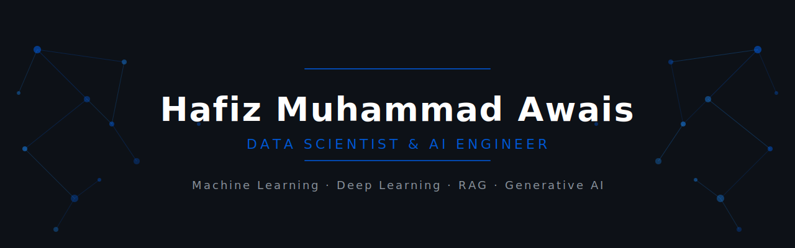
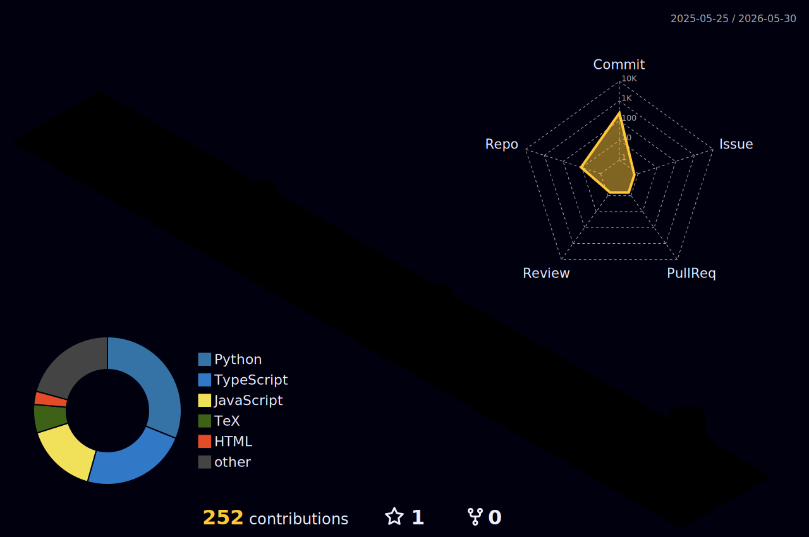

  

---

## 👨‍💻 About Me

I'm a **Data Scientist and AI Engineer** from Pakistan, specialising in building end-to-end intelligent systems — from autonomous multi-agent ML pipelines to deployed Generative AI applications and computer vision systems in healthcare.

My work spans research and engineering. My MS thesis on **Diabetic Retinopathy Detection** using EfficientNetV2-S was **published in IEEE Access (2025)** and deployed as a live serverless system on AWS Lambda. On the engineering side, I build full-stack AI platforms — my flagship project InsightForge AI is a 14-step autonomous ML pipeline orchestrated by LangGraph agents, with a React 19 + TypeScript frontend and FastAPI backend, containerised with Docker and deployed on HuggingFace Spaces.

With **39 verified certifications** from IBM, DeepLearning.AI, Stanford, Google, Coursera, and DataCamp — including Andrew Ng's Machine Learning Specialization and the IBM Professional Data Science Certificate — I pair structured learning with production-grade projects.

> *"I don't just learn concepts — I build things with them, ship them, and publish the results."*

---

## 📄 Research & Publications

  
| Title | Journal | Year | Links |
|---|---|---|---|
| **Improving Inference Time in Diabetic Retinopathy — Recent Trends and Future Directions** | IEEE Access | 2025 | [Paper →](https://ieeexplore.ieee.org/document/11153952/) &nbsp;·&nbsp; [Live Demo →](http://dr-detection-frontend-858758523999.s3-website-us-east-1.amazonaws.com/) |

*MS Thesis project — 5-class severity grading model trained on the APTOS 2019 fundus image dataset, deployed serverlessly on AWS Lambda + ECR with a static frontend on AWS S3.*

---

## 🚀 Featured Projects

| Project | What It Does | Stack | Links |
|---|---|---|---|
| 🧠 **InsightForge AI** | Autonomous full-stack ML platform — upload a dataset and receive a production-ready pipeline in minutes. 8 specialised LangGraph agents handle profiling, EDA, cleaning, feature engineering, training, evaluation, and reporting across a 14-step no-code workflow. Supports Groq, Gemini, OpenAI, and OpenRouter via a unified LLM router. | LangGraph · FastAPI · React 19 · TypeScript · Docker · XGBoost · LightGBM · Optuna · SHAP | [Repo →](https://github.com/hafiz-m-awais/InsightForge-AI) &nbsp;·&nbsp; [Live →](https://huggingface.co/spaces/awaisriaz/InsightForgeAI) |
| 🏥 **RetinaScan** | IEEE Access (2025) · MS Thesis. EfficientNetV2-S model for 5-class diabetic retinopathy grading trained on the APTOS 2019 dataset. Deployed serverlessly on AWS Lambda + ECR; drag-and-drop frontend on AWS S3 returns per-class confidence scores in real time. | PyTorch · EfficientNetV2-S · FastAPI · Docker · AWS Lambda · AWS ECR · AWS S3 | [Repo →](https://github.com/hafiz-m-awais/Diabetic-Retinopathy-Detection) &nbsp;·&nbsp; [Live →](http://dr-detection-frontend-858758523999.s3-website-us-east-1.amazonaws.com/) |
| 🤖 **NeuroTutor** | Real-time AI tutor built for Pakistani CS and Data Science students. Powered by Google Gemini with Server-Sent Events streaming. Features in-browser Python execution via Pyodide, abuse prevention via Flask-Limiter, dark mode UI, and production deployment through Docker + Gunicorn on HuggingFace Spaces. | Flask · Google Gemini · SSE · Pyodide · Flask-Limiter · Docker · Gunicorn · HuggingFace Spaces | [Repo →](https://github.com/hafiz-m-awais/NeuroTutor) &nbsp;·&nbsp; [Live →](https://huggingface.co/spaces/awaisriaz/NeuroTutor) |
| 🇵🇰 **RAG Chatbot Pakistan** | Retrieval-Augmented Generation chatbot grounded in a custom Pakistani dataset covering history, geography, economy, and culture. Built with LangChain and Chainlit, powered by HuggingFace Transformers with a real-time GUI. | LangChain · Chainlit · PyTorch · HuggingFace Transformers | [Repo →](https://github.com/hafiz-m-awais/RAG-Chatbot-Pakistan) |

---

## 🌐 Live Deployments

| Project | Platform | Status | Link |
|---|---|---|---|
| 🧠 InsightForge AI | HuggingFace Spaces · Docker | 🟢 Running | [Open App →](https://huggingface.co/spaces/awaisriaz/InsightForgeAI) |
| 🏥 RetinaScan | AWS Lambda · AWS S3 | 🟢 Running | [Open App →](http://dr-detection-frontend-858758523999.s3-website-us-east-1.amazonaws.com/) |
| 🤖 NeuroTutor | HuggingFace Spaces · Docker | 🟢 Running | [Open App →](https://huggingface.co/spaces/awaisriaz/NeuroTutor) |

---

## 🛠️ Tech Stack

**Languages**

**Backend & APIs**

**Frontend**

**Machine Learning & Deep Learning**

**Generative AI & Agentic Systems**

**Data Analysis & Visualisation**

**Deployment & Cloud**

---

## 🏆 Certifications (**Featured**)

  
| Certificate | Issuer | Year |
|---|---|---|
| IBM Professional Data Science Certificate | IBM / Coursera | 2024 |
| Machine Learning Specialization | DeepLearning.AI · Andrew Ng | 2024 |
| Retrieval-Augmented Generation (RAG) | DeepLearning.AI | 2025 |
| Applied Data Science Capstone | IBM / Coursera | 2024 |

&nbsp;

📂 [View Full Certifications Portfolio →](https://github.com/hafiz-m-awais/Certifications)

---

## 📊 GitHub Stats

&nbsp;

  

  
<!-- ==============================================Comment=============================================

 

 
===================================comment end ======================================== -->
<picture>
  <source media="(prefers-color-scheme: dark)" srcset="https://raw.githubusercontent.com/hafiz-m-awais/hafiz-m-awais/output/github-contribution-grid-snake-dark.svg"/>
  <source media="(prefers-color-scheme: light)" srcset="https://raw.githubusercontent.com/hafiz-m-awais/hafiz-m-awais/output/github-contribution-grid-snake.svg"/>
  
</picture>

---

## 🌱 Currently Learning

---

## 📩 Let's Connect

I'm open to collaborating on AI research, agentic systems, and applied ML — or simply exchanging ideas.

 

*⭐ If you find my work useful, consider starring my repositories — it helps more than you'd think.*

---
<!--

3D Contribution Graph · Automated via GitHub Actions
  

 -->
